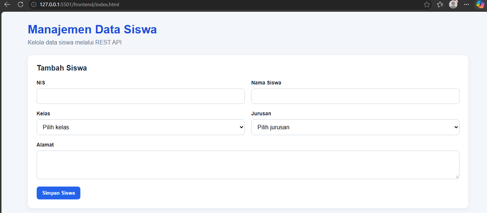
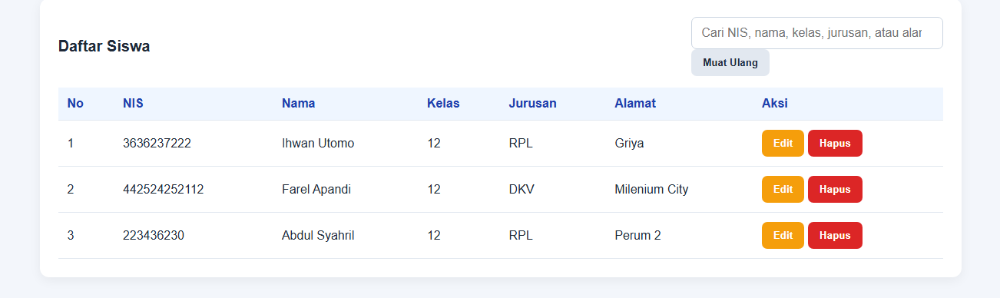
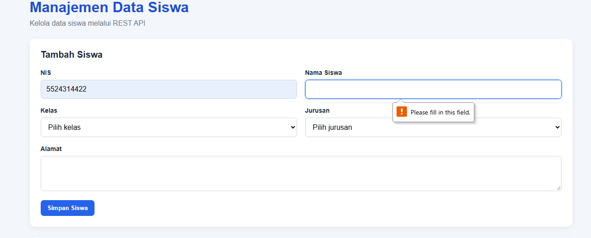
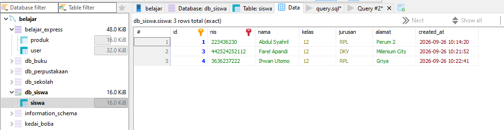
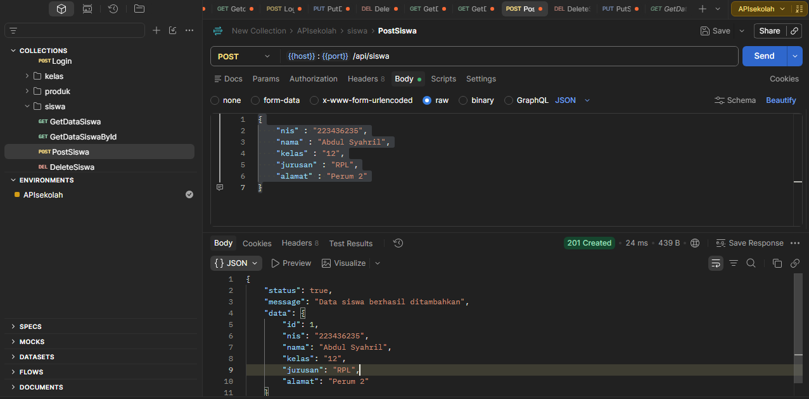
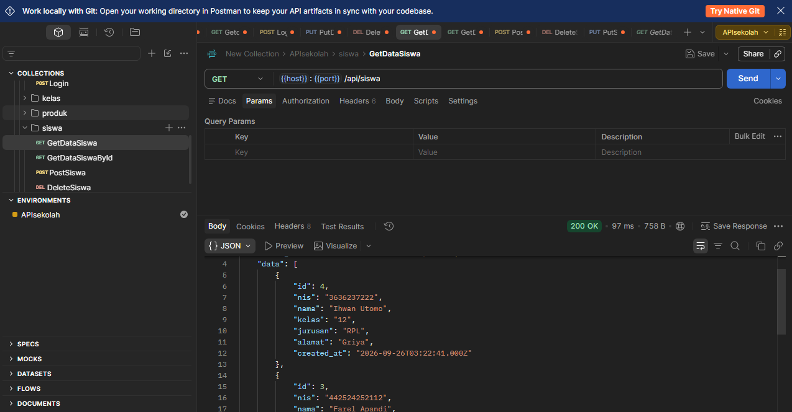
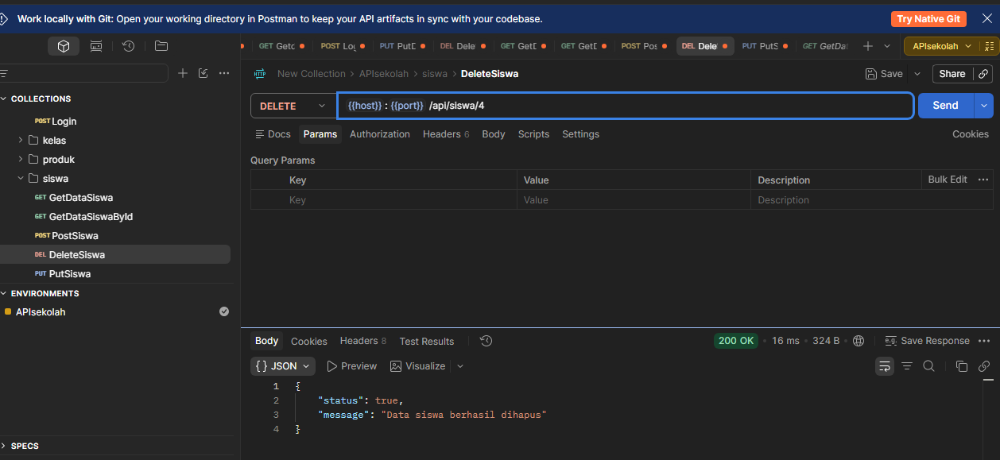
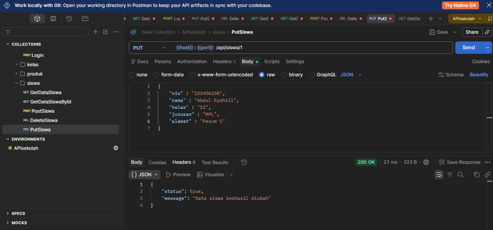

# Student Management REST API

## 1. Nama Aplikasi
**Student Management — Aplikasi Manajemen Data Siswa**

## 2. Deskripsi Aplikasi
Student Management adalah aplikasi untuk mengelola data siswa. Aplikasi ini memungkinkan pengguna dapat melihat, menambahkan, mengubah, menghapus, dan mencari data siswa.

Data siswa disimpan menggunakan database MySQL. Backend dibuat menggunakan Express.js, sedangkan frontend menggunakan HTML, CSS, dan JavaScript untuk berkomunikasi dengan API.

## 3. Teknologi yang Digunakan
- Node.js
- Express.js
- MySQL
- mysql2
- HTML
- CSS
- JavaScript
- Fetch API
- Git dan GitHub

## 4. Cara Menjalankan Backend

### Persiapan
1. Pastikan Node.js dan MySQL sudah terpasang.
2. Jalankan MySQL melalui Laragon atau aplikasi yang digunakan.
3. Buat database `db_siswa` dan tabel `siswa` sesuai struktur database project.
4. Pastikan konfigurasi koneksi database di project sudah benar.

### Menjalankan Server
Buka terminal pada folder project, kemudian jalankan:

git bash
    npm install

Setelah dependency selesai di-install, jalankan server:

git bash
    node server.js

Jika server berhasil berjalan, backend dapat diakses melalui:

http://localhost:3000

## 5. Cara Menjalankan Frontend
1. Pastikan backend sudah berjalan.
2. Buka folder `frontend`.
3. Jalankan file `index.html` menggunakan ekstensi Live Server di Visual Studio Code.
4. Aplikasi akan terbuka di browser.
5. Pastikan frontend menggunakan alamat API backend yang benar.

## 6. Daftar Endpoint API

| Method | Endpoint | Fungsi |
|---|---|---|
| GET | `/api/siswa` | Menampilkan semua data siswa |
| GET | `/api/siswa/:id` | Menampilkan detail siswa berdasarkan ID |
| POST | `/api/siswa` | Menambahkan data siswa |
| PUT | `/api/siswa/:id` | Mengubah data siswa berdasarkan ID |
| DELETE | `/api/siswa/:id` | Menghapus data siswa berdasarkan ID |

## 7. Screenshot Aplikasi

## Screenshot API

## 8. Identitas Pembuat

- **Nama:** [Putra Kasela]
- **Kelas:** [ 12 ]
- **Jurusan:** [ RPL ]

URL Repository GirHUb:
https://github.com/kaselaputraaa/student-management-rest-api